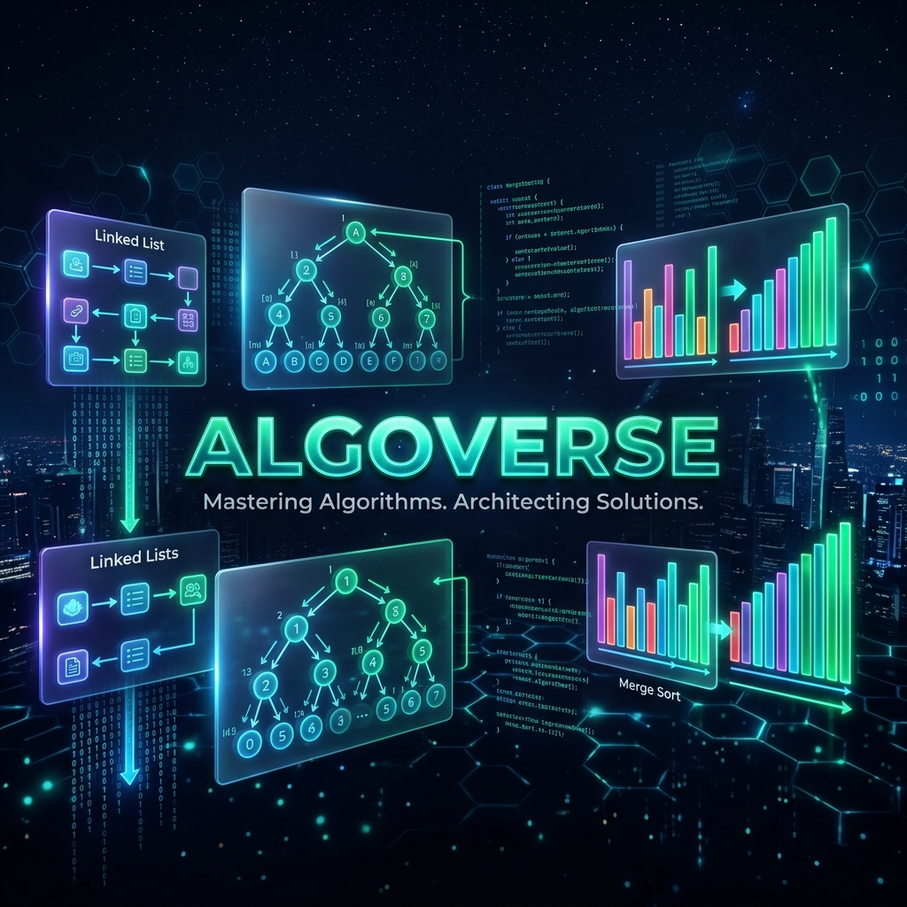

# 🌌 AlgoVerse



**AlgoVerse** is a professional-grade, multilingual DSA (Data Structures & Algorithms) visualization, analysis, and benchmarking platform. Designed for engineers and students alike, it combines the interactive beauty of modern web frameworks with the high-performance analytical power of the Julia language.

Unlike traditional visualizers, AlgoVerse treats algorithms as **data pipelines**. It uses a strictly versioned contract system to orchestrate execution across multiple languages, ensuring that performance benchmarks are as precise as the visualizations are fluid.

---

## 🚀 Key Features

- **Polyglot Execution**: Compare algorithm logic across Python and Julia (with support for Rust/Go in the roadmap).
- **High-Performance Benchmarking**: Leverages `BenchmarkTools.jl` for industry-standard performance metrics (memory allocation, execution time, garbage collection).
- **Contract-Driven Visualization**: Real-time event replay system (comparisons, swaps, access) driven by a strict JSON contract.
- **Complexity Analysis**: Automated asymptotic analysis and O-notation curve plotting (D3.js integration).
- **Persistent Analytics Engine**: A dedicated Julia microservice (`Oxygen.jl`) handles heavy computations, reducing frontend overhead.
- **Interactive Replay**: Pause, rewind, and step through algorithm execution events.

---

## 🏗️ Technical Architecture

AlgoVerse is built as a modular monorepo, separating orchestration from execution and visualization.

### 1. **The Orchestrator (Backend)**
- **Tech**: FastAPI (Python)
- **Role**: Acts as the API Gateway. It handles input validation, proxies requests to language-specific engines, and manages the algorithm execution lifecycle.

### 2. **The Analytics Engine (Julia Service)**
- **Tech**: Oxygen.jl, BenchmarkTools.jl, JSON3.jl
- **Role**: A high-performance worker that executes the heavy lifting. It returns structured "event streams" for visualization and "metric payloads" for benchmarking.

### 3. **The Lab (Frontend)**
- **Tech**: React (Vite + TypeScript), Tailwind CSS, Framer Motion
- **Role**: A premium dashboard that renders the algorithm replay. It uses a generic replay engine that doesn't care which language produced the events—only that they follow the **AlgoVerse Contract**.

---

## 📜 The AlgoVerse Contract (v1.0)

At the heart of the project is the `VersionedAlgorithmContract`. Every execution produces a standardized JSON payload:

```json
{
  "version": "1.0",
  "algorithm": "quicksort",
  "language": "julia",
  "events": [
    { "type": "COMPARE", "indices": [0, 1], "metadata": { "pivot": 42 } },
    { "type": "SWAP", "indices": [0, 5] }
  ],
  "metrics": {
    "execution_time_ns": 1500,
    "memory_allocated_bytes": 256,
    "complexity": "O(n log n)"
  }
}
```

This decoupling allows us to add new languages or visualization styles without breaking the core system.

---

## 🛠️ Getting Started

### Prerequisites
- **Python 3.9+**
- **Julia 1.10+**
- **Node.js 18+**

### Local Setup (One-Click)
We provide a helper script to spin up the entire stack, including automatic port cleanup.

```bash
# Clone the repository
git clone https://github.com/your-username/AlgoVerse.git
cd AlgoVerse

# Run the local development stack
chmod +x run_local.sh
./run_local.sh
```

The stack will initialize:
- **Frontend**: `http://localhost:5173`
- **FastAPI API**: `http://localhost:8000`
- **Julia Engine**: `http://localhost:8080`

---

## 🗺️ Roadmap

- [x] **Phase 1**: Core Orchestrator + Julia Service Integration.
- [x] **Phase 2**: Versioned Contract & Sorting Visualizer.
- [ ] **Phase 3**: Persistence Layer (PostgreSQL) for Benchmark History.
- [ ] **Phase 4**: D3.js Asymptotic Complexity Dashboard.
- [ ] **Phase 5**: Rust Execution Engine & WebAssembly Support.
- [ ] **Phase 6**: "Battle Mode" (Side-by-side language performance comparison).

---

## ⚖️ License

Distributed under the MIT License. See `LICENSE` for more information.

---

Built with ❤️ for the engineering community.
